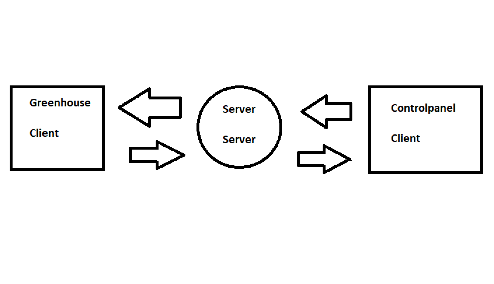

# Communication protocol

This document describes the protocol used for communication between the different nodes of the
distributed application.

## **Terminology**

* **Greenhouse** - The simulated environment representing the project context, including sensors and actuators.
* **Sensor** - A device which senses the environment and describes it with a value (an integer value in the context of this project). Examples: temperature sensor, humidity sensor.
* **Actuator** - A device which can influence the environment. Examples: a fan, a window opener/closer, door opener/closer, heater.
* **Sensor and actuator node** - A computer which has direct access to a set of sensors, a set of actuators, and is connected to the Internet.
* **Control-panel node** - A device connected to the Internet which visualizes the status of sensor and actuator nodes and sends control commands to them.
* **Graphical User Interface (GUI)** - A graphical interface where users of the system can interact with it.
* **Intermediary for managing commands** - A software layer responsible for handling and routing commands between nodes.
* **AES encryption (symmetric)** - A symmetric encryption method where the same key is used for both encryption and decryption.
* **RSA encryption (asymmetric)** - An encryption method where a public key is used for encryption and a private key for decryption.
* **TCP** - Transmission Control Protocol, a communication standard enabling reliable data transfer over a network.

## The underlying transport protocol

TODO - what transport-layer protocol do you use? TCP? UDP? What port number(s)? Why did you choose this transport layer protocol?
- TCP 
- Port number: 50500, if already in use, tries a different port number. Increasing by 20 every time if it fails to connect to given port number.
- We chose TCP because it is a connection-oriented protocol, which means that it guarantees the delivery of packets to the destination node. This is important for our system because we want to make sure that all messages are delivered to the destination node.

## The architecture

**Clients**
Clients are the nodes that initiate communication with the server to send requests and receive responses.

**Types of clients in the system:**

1. **Greenhouse nodes:** These are sensor and actuator nodes that send sensor data to the server and receive commands from the server to control the actuators.

2. **Control panels:** These are clients that ask for/recieve sensor data form the server and send commands to the server to control the actuators.

**Server**
The central entity managing client connections and routing messages. It is responsible for receiving sensor data from greenhouse nodes, sending commands to greenhouse nodes, and relaying sensor data to control panels (When it recieves messages it sends the message where the message want to be sent ish.). It is represented by the `IntermediaryServer` class, which uses `ClientHandler` to manage individual client connections.

## The flow of information and events

### Intermediary server

The different nodes in the system communicate with each other through the intermediary server. The intermediary server is responsible for managing client connections and routing messages between clients. It uses the `ClientHandler` class to manage individual client connections. When a node, control panel or greenhouse, first conenct to the intermediary server, they send an identification message so that the server can keep track of the nodes. The server then uses this information to route messages between the nodes.

### Control panel

Control panels connect to the intermediary server, which routes the control panel's commands to the greenhouse nodes. The control panel can send commands to the greenhouse nodes to control the actuators. The control panel can also request sensor data from the greenhouse nodes, which the intermediary server retrieves and sends back to the control panel.

The control panel can pull information from the greenhouse nodes at any time by sending commands, which are routed from the server to the correct greenhouse nodes.

In addition to pulling information at will, the control panel periodically sends a command requesting sensor data from the greenhouse node(s).

When the control panel receives a response from its sent command, it handles it differently depending on the command type. For example, if the command was to get sensor data, the control panel would notify listeners about the new sensor data.

When the user interacts with the control panel GUI, the control panel sends commands to the intermediary server, which routes them to the appropriate greenhouse nodes.

### Greenhouse node

Greenhouse nodes connect to the intermediary server, which routes messages between the greenhouse nodes and control panels. The greenhouse nodes send sensor data to the intermediary server when data is requested, which forwards it to the control panels. When the greenhouse node receives a command, it executes the command and sends a response back to the intermediary server, which forwards it to the control panel.

The greenhouse cannot push information.

## Connection and state

The protocol used is connection-oriented, as it uses TCP, which establishes a connection between the client and the server before sending data.

The protocol is stateful, as the server maintains the state of the nodes connected to it throughout the session.
The state includes information such as Node ID, ClientTypes, and the connection status.

## Types, constants
Client constants:
- CONTROL_PANEL : Represents the control panel client, established with the value `CONTROL_PANEL`.
- GREENHOUSE : Represents the greenhouse client, established with the value `GREENHOUSE`.
- SERVER : Represents the intermediary server, established with the value `SERVER`.

- BROADCAST : Represents a broadcast message to all clients established with the value `BROADCAST`.
- NOT_PREDEFINED : Represents a specific client ID, established with the value `?`.
- NONE : Represents no client ID, established with the value `NONE`.

Delimiters;
- HEADER_BODY : Delimiter between the header and body of a message, established with the value `-`.
- HEADER_FIELD : Delimiter between fields in the header of a message, established with the value `;`.
- BODY_FIELD : Delimiter between fields in the body of a message, defaulting to the header delimiter.
- BODY_FIELD_PARAMETERS : Delimiter between a fields parameters in the body of a message, established 
with the value `,`.
- BODY_SENSOR_SEPARATOR : Delimiter between sensor data in the body of a message, established with the value `¤`.

## Message Format
All messages consist of the following parts:

### **Header**
- `DST`: Destination (e.g., `GREENHOUSE` or `CONTROL_PANEL`)
- `DST_ID`: The ID of the destination (specific node or broadcast ID)
- `DATA_TYPE`: Specifies the type of message (e.g., `COMMAND`, `RESPONSE`)

### **Body**
- Contains the transmission. A transmission can be either a response or a command. A response is a reply to a command, while a command is an instruction to execute an action. The response will contain some data for the executed command, and information about the success or failure of the command. Additionally the response will contain information about what command was executed.

- Transmission:
    - `COMMAND`: A command to execute an action.
      - `GREENHOUSE_COMMAND`: A command for a greenhouse node.
    - `RESPONSE`: A response to a command.
      - `SUCCESS`: The command was executed successfully.
      - `FAILURE`: The command failed to execute.

### **Example Message**

Result:
- DST;DST_ID;DATA_TYPE COMMAND
- GREENHOUSE;AllId;STRING GET_NODE_ID

### Message Types

#### **1. Command Messages**
- Sent from `CONTROL_PANEL` to `GREENHOUSE`.
- Examples:
    - `GET_NODE_ID`: Request node ID from a greenhouse node.
    - `ACTUATOR_CHANGE`: Change the state of an actuator.

#### **2. Sensor Messages**
- Sent from `GREENHOUSE` to `CONTROL_PANEL`.
- Examples:
    - Status updates for sensors.
    - Actuator state confirmations.

#### **3. Indetification request**
- Sent from `GREENHOUSE` and `GREENHOUSE` to `SERVER`

### Message Flow

#### **Control Panel**
- Sends commands like `GET_NODE_ID` or `ACTUATOR_CHANGE` to specific nodes or broadcasts to all nodes.

#### **Greenhouse Node**
- Receives commands, processes them, and optionally sends back responses (e.g., node ID or execution status).

### Marshalling in Message Formatting

In this Java application, **marshalling** refers to the process of converting data into a specific format for communication between components (such as the `Control Panel` and `Greenhouse`). This process ensures that data can be serialized into messages with proper delimiters, allowing the message to be easily parsed, transmitted, and interpreted on the receiving end.

#### Delimiters in Marshalling

The `Delimiters` enum in the `no.ntnu.messages` package defines various separators that are crucial for the formatting and parsing of messages. These delimiters ensure that different parts of a message (e.g., header, body, and parameters) are properly separated.

##### **Delimiters for Marshalling**

The following delimiters are defined:

1. **`HEADER_BODY`** (`"-"`)
    - Used to separate the **header** from the **body** of a message.
    - Example: `HEADER-BODY`

2. **`HEADER_FIELD`** (`";"`)
    - Used to separate fields in the **header** of the message.
    - Example: `DST;DST_ID;DATA_TYPE`

3. **`BODY_FIELD`** (`HEADER_FIELD.getValue()`)
    - Default delimiter between fields in the **body** of a message, which is the same as the `HEADER_FIELD` delimiter.
    - Example: `ACTUATOR_CHANGE;ON`

4. **`BODY_FIELD_PARAMETERS`** (`","`)
    - Used to separate **parameters** in the **body** of a message. This delimiter is used specifically when a command or sensor message requires multiple parameters.
    - Example: `1,ON`

5. **`BODY_SENSOR_SEPARATOR`** (`"¤"`)
    - Used to separate **sensor data** in the body of a message.
    - Example: `Temperature¤Humidity¤Soil Moisture`

### Command types

COMMON COMMANDS

- ClientIdentificationTransmission: Represents a transmission for client identification.

GREENHOUSE COMMANDS

- GreenhouseCommand: Abstract class representing a command from GREENHOUSE.

- ActuatorChangeCommand: 
- GetNodeCommand: Get info on specific NODE.
- GetNodeIdCommand: Get id for specific NODE.
- GetSensorDataCommand: Retrieve data from specific SENSOR.
- TurnOffAllActuatorInNodeCommand: Command to turn off all ACTUATORS.
- TurnOnAllActuatorInNodeCommand: Command to turn on all ACTUATORS.

---

## Errors and Handling
### **Examples of Errors**
1. **Invalid Message Format**:
    - Return a failure response indicating the reason.
2. **Unknown Command**:
    - Ignore the message or log an error.
3. **Client Not Found**:
    - Notify the sender or log the issue.

### Error messages

- **SERVER_NOT_RUNNING**: 
- Indicates that the server is not running.

- **Unknown Command**:
- Indicates that the client has received an unknown command.

- **INTEGRITY_ERROR**:
- Indicates that the message integrity check failed.

TODO - describe the possible error messages that nodes can send in your system.

---

## An example scenario

TODO - describe a typical scenario. How would it look like from communication perspective? When 
are connections established? Which packets are sent? How do nodes react on the packets? An 
example scenario could be as follows:
1. A sensor node with ID=1 is started. It has a temperature sensor, two humidity sensors. It can
   also open a window.
2. A sensor node with ID=2 is started. It has a single temperature sensor and can control two fans
   and a heater.
3. A control panel node is started.
4. Another control panel node is started.
5. A sensor node with ID=3 is started. It has a two temperature sensors and no actuators.
6. After 5 seconds all three sensor/actuator nodes broadcast their sensor data.
7. The user of the first-control panel presses on the button "ON" for the first fan of
   sensor/actuator node with ID=2.
8. The user of the second control-panel node presses on the button "turn off all actuators".

## Reliability and security

### Security:

**Justification for RSA**: RSA is a well-established cryptographic algorithm offering strong security
for encrypting sensitive data or securely exchanging keys. Its public/private key mechanism
ensures that only authorized users with the private key can decrypt the data.

**Justification for asymmetric encryption**: Unlike symmetric encryption, RSA does not require both
parties to share a secret key beforehand, which simplifies key distribution and enhances
security for scenarios where secure communication is required over untrusted networks.

Note: This class uses 2048-bit RSA keys, providing robust security. For even greater protection,
consider using 3072 or 4096-bit keys, depending on performance and security requirements.

### Reliability:
  - For reliability a hashing algorithm is being used.

  - Justification for hashing algorithm: Hashing algorithms like SHA-256 are used to ensure data integrity. The hash
  function generates a fixed-size output (hash) that uniquely represents the message. When
  transmitting messages over unreliable networks, hashes can verify the integrity of the
  message and ensure it has not been tampered with or altered. This also provides
  lightweight verification without adding computational overhead.

    - Message Integrity Check: By hashing the message on both the sender and receiver
  sides, we ensure that any corruption during transmission can be detected. If the
  received hash doesn't match the hash computed on the receiver's side, the message is
  considered tampered or corrupted, and the sender is notified to resend.